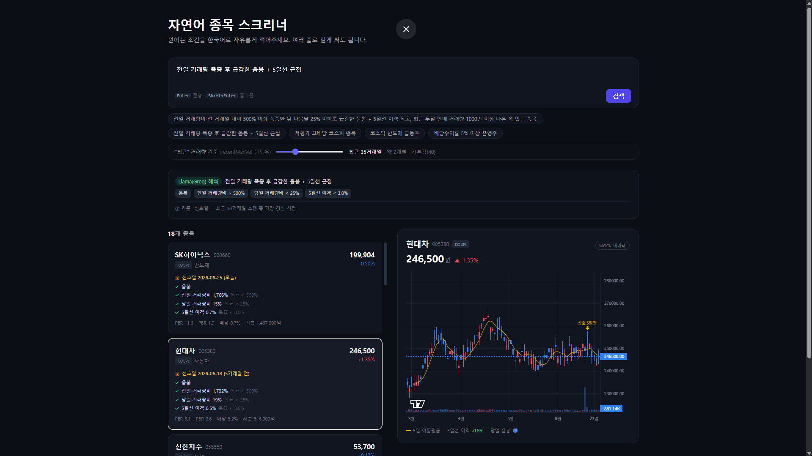

# 자연어 종목 스크리너 (NL Stock Screener)

> "저평가 고배당 코스닥 중소형주" 처럼 **한국어 문장으로 한국 주식 종목을 찾아주는** 풀스택 웹앱.
> Next.js 하나로 프론트엔드 + 백엔드(API 라우트)를 통합했고, 키 없이도 mock 데이터로 즉시 실행됩니다.

> 📸 스크린샷: 앱을 실행해 `저평가 고배당 코스피 종목` 검색 화면을 캡처한 뒤 `docs/screenshot.png`로 저장하면 여기 표시됩니다.
> <!--  -->

🔗 **라이브 데모:** _(Vercel 배포 후 링크 추가)_

---

## 무엇을 푸는가

자연어 입력 → 구조화된 필터 → 종목 리스트 → 클릭 시 일봉 차트. 핵심 설계 결정 3가지:

| 문제 | 해결 |
| --- | --- |
| **키 보안** — KIS app secret / Claude 키를 브라우저에 노출하면 안 됨 | 모든 외부 호출을 **Next.js 서버 라우트**에서만 수행. 브라우저는 내 서버하고만 통신. |
| **CORS** — KIS API는 브라우저에서 직접 호출 불가 | 서버 라우트가 프록시 역할. |
| **호출 제한** — 전 종목(~2,600개)을 매번 긁으면 한도 초과 | 장 마감 후 **하루 한 번 스냅샷 캐싱** → 검색은 캐시에서 즉시 처리. 차트만 클릭 시 실시간 호출. |

## 지원하는 검색 조건

**펀더멘털** — 종목당 한 줄(밸류·배당·규모 등) 스냅샷에서 필터링

- `저평가` → PER<10 / PBR<1 · `고배당` → 배당수익률>4% · `우량주` → ROE>10%
- `대형주`/`중소형주` → 시가총액 · `급등`/`급락` → 등락률 · 섹터(`반도체`, `은행`…)

**기술적 / 캔들 패턴** — 종목당 최근 시계열에서 파생 지표를 계산해 필터링

- `거래량 폭증` → 전일 거래량이 전전일 대비 ≥500% (`volSurgeRatio`)
- `거래량 급감` → 당일 거래량이 전일 대비 ≤25% (`volDropRatio`, 낮은 순 정렬)
- `음봉`/`양봉` → 당일 시가 대비 종가 (`bearish`)
- `5일선 근접`/`이격 작음` → 5일 이동평균과의 이격도 (`gap5MAAbs`)

> 예: **"전일 거래량 폭증 후 급감한 음봉 + 5일선 근접"** → 위 4개 조건이 모두 필터로 변환되고, 차트에 5일 이동평균선이 오버레이됩니다.
>
> ⚙️ 펀더멘털과 기술 지표가 한 레코드로 합쳐진 **enriched universe**(`src/lib/universe.ts`)에서 검색합니다. 데모에서는 결정론적 mock 캔들에 거래량 폭증→급감 같은 패턴을 일부 종목에 주입해 실제 매칭이 나오게 했고, 실데이터에서는 동일 계산을 KIS 일봉에 적용하면 됩니다.
>
> 📌 뉴스·공시(호재 이벤트) 기반 조건은 KIS만으로는 안 되고 DART 공시 API + 뉴스 소스가 별도로 필요해 아직 미지원입니다.

## 데이터 흐름

```
[브라우저]  자연어 입력  "저평가 고배당 코스닥 중소형주"
     │
     ▼  POST /api/screen
[Next.js 서버 라우트]
     │  ① Claude API로 필터 JSON 생성
     │     { market:"KOSDAQ", conditions:[ PER<10, 배당>4, 시총<5000억 ] }
     │  ② 캐시된 전종목 스냅샷에서 필터링
     ▼
[브라우저]  결과 카드 리스트 (매칭된 조건 표시 = explainability)
     │
     ▼  종목 클릭 → GET /api/chart?code=...
[Next.js 서버 라우트]  KIS 일봉 호출
     ▼
[브라우저]  Lightweight Charts 캔들/거래량 렌더
```

키(`ANTHROPIC_API_KEY`, `KIS_APP_KEY/SECRET`)는 전부 서버 라우트 안에만 존재합니다.

## 기술 스택

- **Next.js 14 (App Router) + TypeScript** — 프론트 + API 라우트 단일 레포
- **Tailwind CSS** — 증권 앱 느낌의 다크 UI (한국식: 상승=빨강, 하락=파랑)
- **TradingView Lightweight Charts** — 캔들 + 거래량 차트
- **Anthropic Claude API** — 자연어 → 필터 JSON (tool use로 구조화 출력 강제)
- **KIS Open API** — 시세 / 일봉 (서버에서만 호출)

## 키 없이 바로 실행 (Mock 모드)

키가 하나도 없어도 동작하도록 설계했습니다:

- `ANTHROPIC_API_KEY` 없음 → **규칙 기반 한국어 파서**가 대신 동작 (저평가/고배당/코스닥/중소형주 등 키워드 인식)
- `KIS_APP_KEY` 없음 → 종목별 **결정론적 mock 캔들** 생성 (같은 종목은 항상 같은 차트)

```bash
npm install
npm run dev
# http://localhost:3000
```

## 실데이터로 전환

```bash
cp .env.example .env.local
# .env.local 에 키 입력
```

| 변수 | 발급처 | 없을 때 |
| --- | --- | --- |
| `ANTHROPIC_API_KEY` | https://console.anthropic.com | 규칙 기반 파서 사용 |
| `KIS_APP_KEY` / `KIS_APP_SECRET` | https://apiportal.koreainvestment.com (모의투자 추천) | mock 캔들 사용 |
| `KIS_USE_SIMULATION` | `true`=모의투자, `false`=실전 | `true` |

키를 채우면 코드 변경 없이 자동으로 Claude 해석 + KIS 실시간 차트로 전환됩니다. 화면 상단/차트 우측의 배지(`Claude 해석` / `KIS 실시간`)로 현재 모드를 확인할 수 있습니다.

## 프로젝트 구조

```
src/
├── app/
│   ├── page.tsx              # 메인 UI (검색 / 결과 / 차트)
│   ├── layout.tsx
│   └── api/
│       ├── screen/route.ts   # 자연어 → 필터 → 종목 리스트
│       └── chart/route.ts    # 종목코드 → 일봉
├── components/
│   ├── ResultCard.tsx        # 종목 카드 + 매칭 조건 배지
│   └── ChartPanel.tsx        # Lightweight Charts 렌더 + 5일 이동평균선
├── lib/
│   ├── parse.ts              # Claude 파서(tool use) + 규칙 기반 폴백
│   ├── screener.ts           # enriched universe에 필터 적용
│   ├── universe.ts           # 펀더멘털 + 기술지표 통합 유니버스 (캐시)
│   ├── candles.ts            # 결정론적 캔들 생성/패턴 주입 + 기술지표 계산
│   ├── fields.ts             # 필드 라벨/포맷 (파서·스크리너 공유)
│   ├── kis.ts                # KIS 토큰/일봉 (mock 폴백)
│   └── types.ts
└── data/
    └── snapshot.ts           # mock 펀더멘털 스냅샷 (프로덕션에선 일배치로 대체)
```

## 배포 (Vercel)

1. GitHub에 push
2. [Vercel](https://vercel.com)에서 레포 import
3. 환경 변수 입력 (없으면 mock 모드로 배포됨)
4. push할 때마다 자동 배포

## 설계 노트

- **Graceful degradation** — 키가 하나도 없어도 mock 모드로 완전히 동작한다. `ANTHROPIC_API_KEY`가 없으면 규칙 기반 파서로, KIS 키가 없으면 결정론적 mock 캔들로 폴백하므로 클론 직후 바로 실행된다.
- **Explainability** — 결과 카드에 "어떤 조건을 만족해서 떴는지"를 실제 값과 함께 배지로 표시한다 (예: `PER 5.1`, `배당수익률 5.2%`).
- **구조화 출력** — 자연어 파싱은 Claude의 tool use로 JSON 스키마를 강제해, 모델 출력이 항상 검증 가능한 필터 형태로 들어오게 했다.
- **트레이드오프** — 개인용/데모라 전 종목 실시간 조회 대신 일배치 스냅샷 캐싱을 택했다. 실시간성은 떨어지지만 외부 API 호출 제한을 피하고 검색 응답이 즉시 나온다.

---

> ⚠️ 학습용 데모입니다. 종목 데이터는 예시 값이며 **투자 자문이 아닙니다.**
